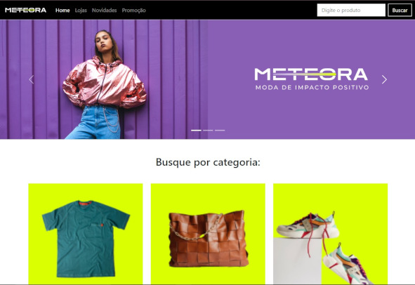

<h1 style="text-align: center"> Projeto de Portfolio</h1>
<h2> 📰 Sobre</h2>

## Projeto  do curso de Bootstrap 5: landing page responsiva, da Alura

O projeto Meteora, um e-commerce, uma loja de roupas e acessórios online. Construído com Bootstrap, JavaScript, HTML e CSS.

## No exploramos:

- Integrar o Bootstrap a um projeto;
- Aplicar sistema de Grids do Bootstrap para organizar elementos de forma responsiva;
- Conhecer e aplicar classes do Bootstrap para definir altura e largura;
- Integrar a biblioteca de ícones do Bootstrap, Bootstrap Icons, ao projeto;
- Classes do Flexbox no Bootstrap ao projeto;
- Aplicar imagens de forma responsiva em um projeto unindo classes de Breakpoint e Display do Bootstrap;
- Refatorar o código para tornar o projeto acessível para leitores de tela;
Implementou classes de acessibilidade do Bootstrap no projeto;

<h2> 🚀 Tecnologias</h2>

 
    
    
    
    

<h2> 📞 Contato</h2>

 
  
  
   
  

  
## Link do Projeto

- [Clique e confira](https://misael1981.github.io/meteora/)
